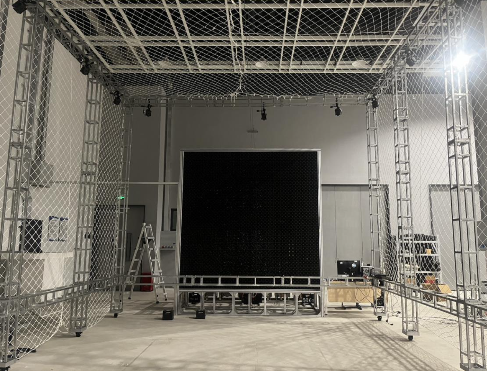
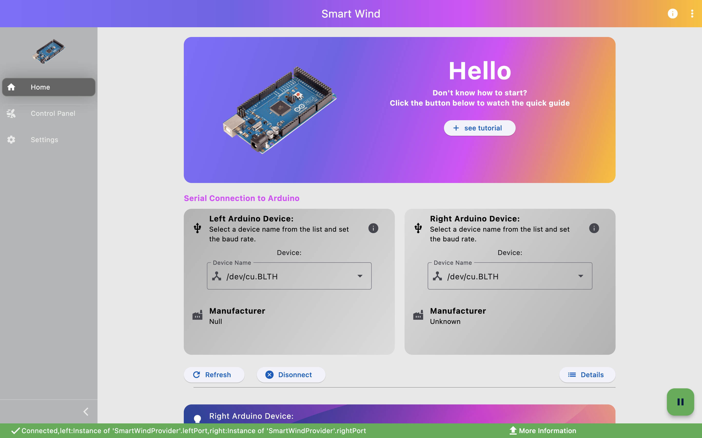
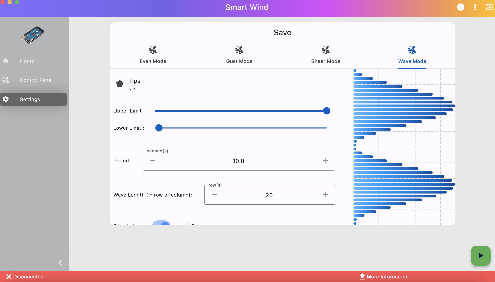

# smart_wind_tunnel

Traditional wind tunnel experiments suffer from many problems such as large footprint, only providing static airflow and difficult operation. In contrast, active simulation wind tunnels are a much more powerful tool for simulating airflow phenomena within the atmospheric boundary layer, and can provide UAVs with a small footprint and high dynamic performance test bed. This project explores a way to construct a highly dynamic active simulation wind tunnel using a 40x40 sized DC motor array.

## Hardware Design 

##Software Screenshots

